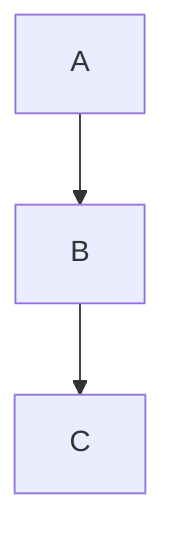

# Strike48 Labs Docs

Static documentation site built with [Lume](https://lume.land/) v3.2.2 (Deno).

## Setup

```
deno task serve    # dev server with hot reload
deno task build    # build to _site/
```

## Writing Pages

Create a `.md` file anywhere. Add frontmatter:

```yaml
---
title: Page Title
description: Optional meta description
---
```

The page URL mirrors the file path: `pick/guides/marketplace.md` → `/pick/guides/marketplace/`.

Pages automatically get the docs layout (`_includes/layouts/docs.vto`), sidebar, TOC, and search indexing. Headings (h2/h3) with IDs populate the right-hand TOC automatically.

To opt out of the docs layout (e.g. the landing page), set `layout: false` in frontmatter.

## Writing Blog Posts

Add a `.md` file to `blog/`. Naming convention: `YYYY-MM-DD_slug.md`.

Required frontmatter:

```yaml
---
title: Post Title
date: 2026-03-19
authors:
  - pragdave
excerpt: >
  One-paragraph summary. Used in the blog index and RSS feed.
nav_order: 3
parent: "Blog"
---
```

- `authors` — list of keys from `author_info` in `_data.yml`
- `nav_order` — controls sort order on the blog index (lower = first)
- The `blog/_data.json` sets `type: "blog"` for all posts in the directory

The 3 most recent posts appear on the landing page under "Lab Notes".

## Adding Authors

Edit `_data.yml`, add to the `author_info` map:

```yaml
author_info:
  your_id:
    name: your_id
    title: Display Name
    url: https://example.com
    picture: https://example.com/avatar.png
```

Then reference `your_id` in blog post `authors` arrays.

## Updating the Sidebar

Edit `_data.yml` under `sidebar`. Structure is nested groups → items → sub-items (up to 4 levels):

```yaml
sidebar:
  - label: "Group Name"
    collapsed: false          # open by default; omit or true to start collapsed
    items:
      - label: Page Name
        url: /path/to/page/
      - label: Section
        collapsed: true
        items:
          - label: Sub Page
            url: /section/sub-page/
```

Active page highlighting and auto-expanding parent sections happen automatically.

## Diagrams

### Mermaid

Standard fenced code blocks. Rendered to SVG at build time with separate light/dark variants:

````md

````

### picjs

[picjs](https://github.com/nicholasgasior/picjs) diagrams, also rendered at build time. Colors auto-invert in dark mode via CSS filter.

````md
```picjs
"Input"
arrow
box "Process" fill lightblue
arrow
"Output"
```
````

Meta options on the code fence:

- `example` — side-by-side source + diagram
- `stacked` — source above diagram
- `width=X` — container width
- `svgwidth=X` — SVG wrapper width (centers diagram)

````md
```picjs example svgwidth="12rem"
box "A"
arrow
box "B"
```
````

## Code Highlighting

Standard fenced code blocks with language tags. Powered by highlight.js via Lume's `code_highlight` plugin. Custom no-op languages registered: `mermaid`, `picjs`, `tape`, `mdx`, `csv`, `no-highlight`.

## Search

[Pagefind](https://pagefind.app/) indexes all pages at build time. Search box is in the sidebar.

## Dark Mode

Theme toggle in the header. Persists to `localStorage`. Flash-free: an inline `<script>` in `<head>` reads the preference before paint.

## Publishing

Commit and push to `main`. GitHub Actions builds and deploys to GitHub Pages.

## Project Structure

```
_config.ts                  # Lume config, plugins, TOC processor
_data.yml                   # Sidebar nav, authors, social links, site metadata
_data.json                  # Global page defaults (lang)
_includes/
  layouts/docs.vto          # Main layout template (Vento)
  partials/sidebar.vto      # Sidebar nav (native <details>/<summary>)
_plugins/
  mermaid.ts                # Build-time mermaid → SVG (light + dark)
  picjs.ts                  # Build-time picjs → SVG
assets/
  css/custom.css            # All styles (no framework dependency)
  js/theme-switcher.js      # Dark/light toggle
  js/sidebar-toggle.js      # Mobile sidebar drawer
  js/cookie-consent.js      # Cookie banner logic
blog/                       # Blog posts (type: blog set by _data.json)
index.njk                   # Landing page (opts out of docs layout)
serve.ts                    # Entry point (imports lume/cli.ts)
```

## RSS

Feeds at `/feed.xml` and `/feed.json`, generated by Lume's feed plugin from all `type=blog` pages.
