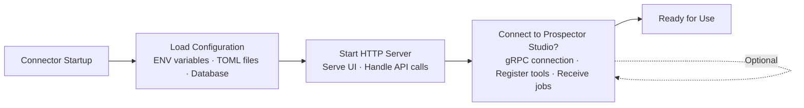
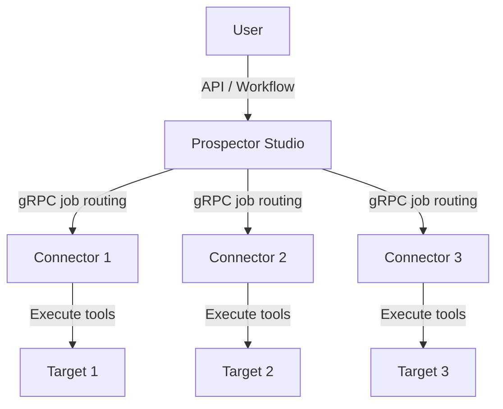

This guide explains how Strike48 products fit together, the role of Prospector Studio, and how connectors are deployed.

## Overview

Strike48 is a collection of security and infrastructure tools built on a **connector architecture**. Connectors are designed to run:

1. **Within StrikeHub** — As embedded connectors in the unified desktop shell
2. **Connected to Prospector Studio** — Hosted in the platform for remote execution, orchestration, and team collaboration

Both modes give you the full Strike48 experience with authentication, tool registration, and centralized management.

## Components

### Prospector Studio

**Prospector Studio** is the Strike48 backend platform. It provides:

- **Agent Orchestration** - Manage distributed connectors across multiple machines
- **Workflow Engine** - Build automated security and infrastructure workflows
- **Job Routing** - Route tool execution requests to appropriate connectors
- **GraphQL API** - Programmatic access to platform features
- **Web UI** - Browser-based management interface

#### Access

Prospector Studio is an internal platform managed by the Strike48 team. Access is authenticated via OIDC (OpenID Connect) using Keycloak or compatible identity providers.

### StrikeHub

**StrikeHub** is the unified desktop shell that hosts multiple connectors in a single window.

**Desktop Mode:**
- ✅ Launches and manages connectors locally
- ✅ Provides sidebar navigation and health monitoring
- ✅ Handles OIDC authentication flow

**Connected to Prospector Studio:**
- ✅ All desktop features
- ✅ Discover connectors across your infrastructure
- ✅ Route jobs to remote connectors
- ✅ Centralized logging and audit trail

### KubeStudio

**KubeStudio** is a Kubernetes cluster management dashboard.

**Via StrikeHub (Desktop):**
- ✅ Full Kubernetes management capabilities
- ✅ Uses local kubeconfig for cluster access
- ✅ Browse namespaces, pods, services
- ✅ View logs and resource details
- ✅ Scale deployments

**Via Prospector Studio (Platform):**
- ✅ All desktop features
- ✅ Share cluster access with team members
- ✅ Centralized audit logging
- ✅ Workflow integration (automated operations)
- ✅ Multi-user collaboration

**Key Point:** Run KubeStudio through StrikeHub for local desktop use, or connect through Prospector Studio for team collaboration and automation.

### Pick

**Pick** is a headless penetration testing toolkit with network scanning and tool execution capabilities.

**Via StrikeHub (Desktop):**
- ✅ Run tools locally via the workspace UI
- ✅ Execute scans on local network
- ✅ Store results locally

**Via Prospector Studio (Platform):**
- ✅ All desktop features
- ✅ Deploy as remote agent on target networks
- ✅ Trigger tools remotely via API or workflows
- ✅ Aggregate results across multiple agents
- ✅ Orchestrate distributed scanning campaigns

**Key Point:** Run Pick through StrikeHub for local desktop use, or host it in Prospector Studio for distributed pentesting and remote execution across multiple networks.

### SDK for Rust

**SDK for Rust** is the developer toolkit for building custom Strike48 connectors.

**Local Development:**
- ✅ Build custom security tools
- ✅ Implement tool executors
- ✅ Test connectors locally

**Deployed via StrikeHub or Prospector Studio:**
- ✅ Register tools with connector registry
- ✅ Receive remote job execution requests
- ✅ Participate in workflows
- ✅ Integrate with orchestration platform

**Key Point:** Use the SDK to build custom connectors, then deploy them through StrikeHub or Prospector Studio for full platform integration.

### StrikeKit

**StrikeKit** is a comprehensive red team operations workstation.

**Via StrikeHub (Desktop):**
- ✅ Full engagement management
- ✅ C2 operations (listeners, agents, commands)
- ✅ Activity tracking and auto-extraction
- ✅ Finding documentation
- ✅ Report generation
- ✅ Local database storage

**Via Prospector Studio (Platform):**
- ✅ All desktop features
- ✅ Multi-user collaboration on engagements
- ✅ Shared intelligence database
- ✅ Workflow integration for automated tasks
- ✅ Centralized reporting and metrics

**Key Point:** Run StrikeKit through StrikeHub for local operations, or connect through Prospector Studio for team collaboration and shared intelligence.


## Architecture Patterns

### Connector Lifecycle

All Strike48 connectors follow this lifecycle:



### Communication Patterns

**StrikeHub (Desktop):**


**Prospector Studio Integration:**


**Distributed Mode (Multiple Connectors):**


## Configuration

### Prospector Studio-Connected Tools

Connectors hosted in Prospector Studio require the following configuration:

```bash
# Environment variables for Prospector Studio integration
export MATRIX_HOST=connectors.strike48.example.com
export MATRIX_API_URL=https://api.strike48.example.com
export MATRIX_TENANT_ID=production
export INSTANCE_ID=pick-agent-1

# Start connector with Prospector Studio integration
./pick --connect-matrix
```

See individual product configuration guides for complete details:
- [SDK-rs Configuration](/developers/sdk-rs/configuration/)
- [StrikeKit Configuration](/developers/strikekit/configuration/)
- [Pick Configuration](/pick/getting-started/configuration/)

## Getting Started

### For Individual Users

1. [Download StrikeHub](/strikehub/getting-started/) and run it on your machine
2. Launch connectors (KubeStudio, Pick, StrikeKit) from the StrikeHub sidebar
3. All your tools in one window with shared authentication and health monitoring

### For Teams

If you're working with a team or need distributed operations:

1. Deploy Prospector Studio — contact the Strike48 team for access
2. Configure OIDC authentication
3. Install connectors on workstations and agents
4. Configure Prospector Studio connection (MATRIX_HOST, credentials)
5. Register connectors with the connector registry

## Security Considerations

### StrikeHub (Desktop)

- IPC via Unix domain sockets (no network exposure)
- Single authentication flow via OIDC
- Connectors inherit permissions from StrikeHub
- Process isolation for security

### Prospector Studio Integration

- Mutual TLS (mTLS) for connector-to-Prospector Studio communication
- OIDC/OAuth2 for user authentication
- Role-based access control (RBAC) for job authorization
- Audit logging for all operations
- Network segmentation recommended

## FAQ

### Do I need Prospector Studio to use Strike48 tools?

**Not necessarily.** You can run all Strike48 connectors through the StrikeHub desktop app for local use. Prospector Studio adds team collaboration, remote execution, and workflow automation for distributed operations.

### How do I get started?

[Download StrikeHub](/strikehub/getting-started/) and launch connectors from the desktop app. For team features, contact the Strike48 team for Prospector Studio access.

### How do I get access to Prospector Studio?

Contact the Strike48 team for access and onboarding.

### Can I run some connectors in StrikeHub and others in Prospector Studio?

**Yes.** Connectors are independent processes. You can run some locally through StrikeHub and connect others to Prospector Studio for remote operations.

## Next Steps

- **Individual Users**: [Download StrikeHub](/strikehub/getting-started/) and start using connectors from the desktop app
- **Teams**: Contact the Strike48 team for Prospector Studio access
- **Developers**: [Start building with the SDK](/developers/sdk-rs/quick-start/)

For questions about architecture or access, reach out to the Strike48 team.
