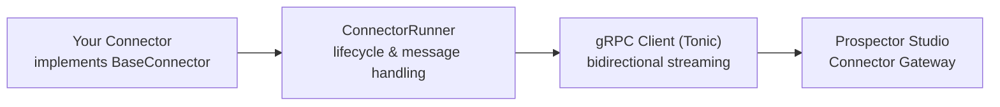

Welcome to the **Strike48 SDK for Rust** documentation. This SDK enables you to build powerful, type-safe connectors that integrate seamlessly with the Prospector Studio connector framework.

## What is the Strike48 SDK?

The Strike48 SDK for Rust is a foundation SDK that provides the core functionality for building connectors. It's used by:

- **Pick** - Build interactive web-based connectors
- **StrikeKit** - Command-line toolkit for connector development
- **KubeStudio** - Kubernetes-native connector orchestration

## Key Features

### High Performance
Built on **Tokio** for async/await support, the SDK delivers high-performance operations with efficient resource utilization.

### Type-Safe Communication
- **gRPC bidirectional streaming** for efficient real-time communication
- **Auto-generated protobuf types** for type safety
- **Multiple payload encodings** (JSON, RAW_BYTES, JSON_LINES, Arrow, Parquet, and more)

### Production-Ready
- **Automatic reconnection** with exponential backoff
- **Session token support** for fast reconnection
- **Comprehensive error handling** with detailed error types
- **Built-in logging** using the `tracing` crate

### Developer-Friendly
- **Simple trait-based API** - implement `BaseConnector` trait
- **Flexible configuration** - environment variables or programmatic
- **Async process execution** - non-blocking command execution
- **Rich examples** to get started quickly

## Architecture Overview

The SDK consists of several key components:

### Core Components

- **`BaseConnector`** - Trait that your connector implements
- **`ConnectorRunner`** - Manages connector lifecycle and message handling
- **`ConnectorHandle`** - Safe handle for sending messages from callbacks
- **`types`** - Type definitions matching protobuf schemas
- **`utils`** - Serialization, deserialization, and helper functions
- **`process`** - Async process execution utilities
- **`error`** - Comprehensive error types

## Who Should Use This SDK?

This SDK is ideal for:

- **DevOps Engineers** building infrastructure automation connectors
- **Platform Engineers** integrating internal tools and services
- **Software Engineers** creating custom integrations
- **System Administrators** automating operational tasks

## Prerequisites

Before getting started, ensure you have:

- **Rust 1.70 or later** installed
- **Protocol Buffers compiler** (`protoc`) installed
- **Prospector Studio** server running (for testing)
- Basic familiarity with **async/await** in Rust

## Next Steps

Ready to get started? Follow these guides in order:

1. [**Installation**](./installation/) - Set up the SDK in your project
2. [**Quick Start**](./quick-start/) - Build your first connector in 5 minutes
3. [**Configuration**](./configuration/) - Learn about configuration options

## Getting Help

- **GitHub Issues** - Report bugs or request features at [github.com/Strike48/sdk-rs](https://github.com/Strike48/sdk-rs/issues)
- **Source Code** - Browse the code at [github.com/Strike48/sdk-rs](https://github.com/Strike48/sdk-rs)
- **Examples** - Check the `examples/` directory in the repository

## License

This SDK is proprietary software. See the LICENSE file for details.
