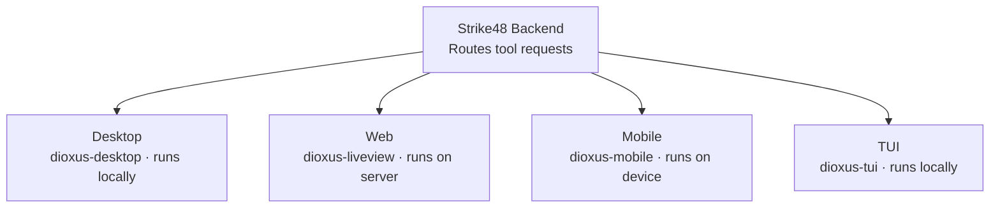
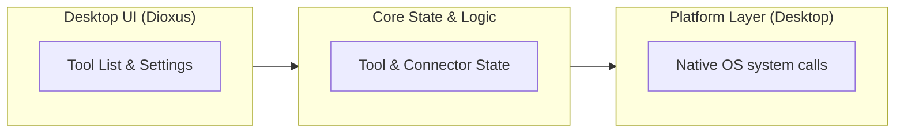
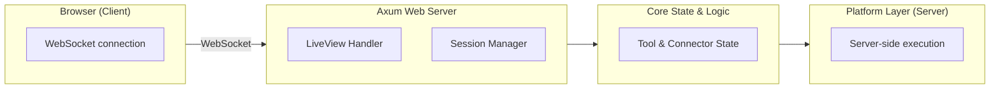
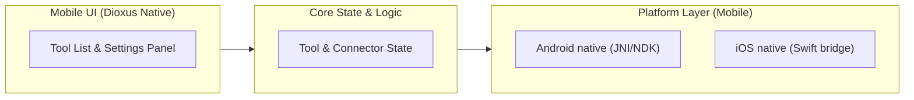
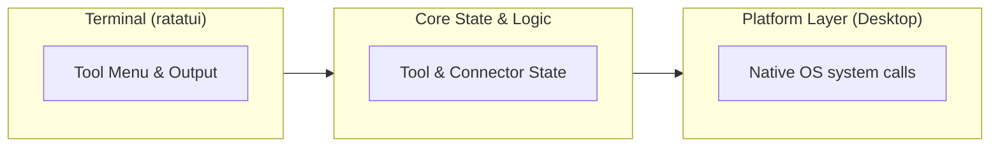
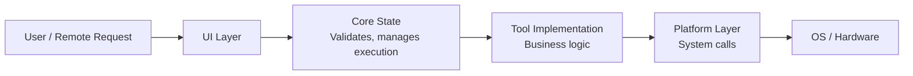
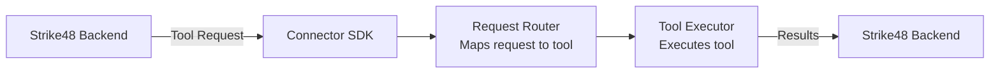

# Architecture

This document provides an in-depth look at Pick's architecture, project structure, and design decisions.

## High-Level Architecture

Pick follows a modular, multi-platform architecture where each application variant (desktop, web, mobile, TUI) is a connector that registers with Strike48 and executes tools locally.

### System Overview



## Project Structure

The project is organized as a Rust workspace with separate crates for shared functionality and platform-specific applications.

```
dioxus-connector/
├── crates/
│   ├── core/          # Core types, state management, SDK integration
│   ├── platform/      # Platform abstraction (desktop, android, ios)
│   ├── ui/            # Shared Dioxus UI components
│   └── tools/         # Tool implementations
├── apps/
│   ├── desktop/       # Desktop app (dioxus-desktop)
│   ├── web/           # Web app (dioxus-liveview + axum)
│   ├── tui/           # Terminal app (dioxus-tui)
│   └── mobile/        # Mobile app (dioxus-mobile)
├── Cargo.toml         # Workspace configuration
└── Cargo.lock
```

## Core Components

### 1. Core Crate (`crates/core`)

The `core` crate contains shared business logic and types used across all platforms.

**Key modules:**

- **`state.rs`**: Global application state management
  - Connection state
  - Tool registry
  - Configuration

- **`connector.rs`**: Strike48 connector integration
  - gRPC/WebSocket client
  - Authentication handling
  - Tool registration
  - Request/response handling

- **`types.rs`**: Common data types
  - Tool definitions
  - Request/response structures
  - Error types

**Dependencies:**
- `strike48-connector-sdk` - Strike48 integration
- `tokio` - Async runtime
- `serde` - Serialization

### 2. Platform Crate (`crates/platform`)

Platform-specific implementations for system operations that differ across operating systems.

**Traits:**

```rust
pub trait NetworkOps {
    async fn port_scan(&self, host: &str, ports: &[u16]) -> Result<Vec<Port>>;
    async fn arp_table(&self) -> Result<Vec<ArpEntry>>;
    async fn wifi_scan(&self) -> Result<Vec<WifiNetwork>>;
    // ...
}

pub trait SystemInfo {
    async fn device_info(&self) -> Result<DeviceInfo>;
    async fn system_stats(&self) -> Result<SystemStats>;
}

pub trait CaptureOps {
    async fn screenshot(&self) -> Result<Vec<u8>>;
    async fn traffic_capture(&self, interface: &str, duration: Duration) -> Result<Vec<u8>>;
}

pub trait CommandExec {
    async fn execute_command(&self, command: &str, args: &[String]) -> Result<CommandOutput>;
}
```

**Platform implementations:**

- `platform/desktop/` - Linux, macOS, Windows
- `platform/android/` - Android-specific (Java/Kotlin FFI)
- `platform/ios/` - iOS-specific (Swift FFI)
- `platform/web/` - Web/server-side operations

### 3. Tools Crate (`crates/tools`)

Individual tool implementations that use platform abstractions.

**Tool structure:**

```rust
pub trait PentestTool {
    fn name(&self) -> &str;
    fn description(&self) -> &str;
    async fn execute(&self, params: ToolParams) -> Result<ToolOutput>;
}
```

**Available tools:**

| Tool | Module | Platform Dependencies |
|------|--------|----------------------|
| Port Scanner | `port_scan.rs` | NetworkOps |
| Device Info | `device_info.rs` | SystemInfo |
| WiFi Scanner | `wifi_scan.rs` | NetworkOps |
| ARP Table | `arp_table.rs` | NetworkOps |
| SSDP Discovery | `ssdp_discover.rs` | NetworkOps |
| mDNS Discovery | `network_discover.rs` | NetworkOps |
| Screenshot | `screenshot.rs` | CaptureOps |
| Traffic Capture | `traffic_capture.rs` | CaptureOps |
| Command Execution | `execute_command.rs` | CommandExec |

### 4. UI Crate (`crates/ui`)

Shared Dioxus UI components used across all graphical applications.

**Key components:**

- **`tool_list.rs`**: List of available tools
- **`tool_card.rs`**: Individual tool display
- **`execution_panel.rs`**: Tool execution interface
- **`results_viewer.rs`**: Display tool results
- **`connection_status.rs`**: Strike48 connection indicator
- **`settings_panel.rs`**: Configuration UI

**Component structure:**

```rust
#[component]
pub fn ToolList(tools: Vec<ToolInfo>) -> Element {
    rsx! {
        div { class: "tool-list",
            for tool in tools {
                ToolCard { tool: tool.clone() }
            }
        }
    }
}
```

## Application Variants

### Desktop Application

**Technology:** dioxus-desktop (WebView-based)

**Architecture:**


**Features:**
- Native window management
- System tray integration
- Local file access
- Direct system API access

### Web Application (LiveView)

**Technology:** dioxus-liveview + axum server

**Architecture:**


**Features:**
- Server-rendered UI
- Real-time updates via WebSocket
- Multi-session support
- Tools execute on server

### Mobile Application

**Technology:** dioxus-mobile (iOS/Android native)

**Architecture:**


**Features:**
- Native mobile UI
- Platform-specific permissions
- Background execution (where allowed)
- Device-specific capabilities

### Terminal Application (TUI)

**Technology:** dioxus-tui (terminal-based)

**Architecture:**


**Features:**
- Text-based interface
- Keyboard navigation
- ANSI color support
- Works over SSH

## Data Flow

### Tool Execution Flow

1. **User initiates tool** (via UI or remote request)
2. **Core state validates** request and parameters
3. **Tool implementation** calls platform abstraction
4. **Platform layer** executes native operations
5. **Results flow back** through layers
6. **UI updates** with results
7. **Results sent to Strike48** (if remote request)



## Strike48 Integration

### Connector Registration

On startup, the connector:

1. Connects to Strike48 backend (gRPC or WebSocket)
2. Authenticates with tenant ID and token
3. Registers available tools
4. Starts listening for tool requests

### Request Handling



## Design Decisions

### Why Dioxus?

- **Single codebase** for multiple platforms
- **Reactive UI** with familiar React-like API
- **Native performance** on desktop and mobile
- **Strong typing** with Rust's type system

### Why Platform Abstraction?

- **Code reuse** across platforms
- **Testability** via trait implementations
- **Flexibility** to add new platforms
- **Separation of concerns** between UI and system operations

### Why Multiple Apps Instead of One?

- **Optimized for each platform** (e.g., web doesn't need native UI)
- **Smaller binary sizes** (only include necessary code)
- **Deployment flexibility** (deploy only what you need)
- **Platform-specific features** without compromise

## Security Considerations

### Privilege Management

- Tools requiring elevated privileges check at runtime
- Clear user warnings for dangerous operations
- Platform-specific permission requests (mobile)

### Data Handling

- No persistent storage of sensitive data
- Tool results encrypted in transit
- Authentication tokens stored securely (OS keychain)

### Network Security

- TLS for all external connections
- Certificate validation
- Connection timeout handling

## Performance Characteristics

### Async Execution

All I/O operations use Tokio async runtime:
- Non-blocking tool execution
- Concurrent operations where safe
- Efficient resource utilization

### Memory Management

Rust's ownership system ensures:
- No memory leaks
- No data races
- Efficient memory usage

## Extending the Connector

### Adding a New Tool

1. Create tool file in `crates/tools/src/`
2. Implement `PentestTool` trait
3. Add to tool registry in `lib.rs`
4. Add platform-specific implementations if needed

### Adding a New Platform

1. Create platform module in `crates/platform/src/`
2. Implement all platform traits
3. Add feature flag to `Cargo.toml`
4. Update platform selection in `get_platform()`

### Adding UI Components

1. Create component in `crates/ui/src/`
2. Use Dioxus component syntax
3. Make it reusable across platforms

## Testing Strategy

### Unit Tests

- Core logic tested independently
- Platform abstractions mocked
- Tools tested with fake platform implementations

### Integration Tests

- Full stack testing per platform
- Real platform operations in CI
- Strike48 integration with test backend

### Platform-Specific Tests

- Conditional compilation for platform tests
- Platform emulators in CI (Android/iOS)

## Build System

### Workspace Structure

Cargo workspace manages all crates:
- Shared dependencies
- Unified build commands
- Incremental compilation

### Platform Targets

```bash
# Desktop
cargo build --package pentest-desktop

# Web
cargo build --package pentest-web

# Mobile (via cargo-mobile2)
cargo mobile android build
cargo mobile ios build

# TUI
cargo build --package pentest-tui
```

## Next Steps

- [Installation Guide](./getting-started/installation.md) - Build and run the connector
- [Configuration Guide](./getting-started/configuration.md) - Configure for your environment
