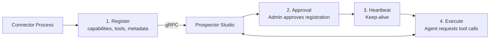

Connectors are external services that integrate with Prospector Studio over a persistent gRPC bidirectional stream. They provide tools, data pipelines, and even full web UIs to the platform.

<video autoplay loop muted playsinline style="width:100%; margin-top:0.75rem; border-radius:0.75rem; box-shadow:0 2px 8px rgba(0,0,0,0.06), 0 8px 24px rgba(0,0,0,0.10);">
  <source src="/assets/img/prospector-studio/videos/connectors.mp4" type="video/mp4" />
</video>

## What Are Connectors?

Connectors extend Prospector Studio by registering capabilities over gRPC. Unlike [MCP Servers](/prospector-studio/guides/mcp-servers/) which use stateless HTTP, connectors maintain a persistent connection and support richer interaction patterns.

A connector can implement one or more behaviors:

| Behavior | Description |
|----------|-------------|
| **Tool** | Provide callable functions for AI agents |
| **Source** | Pull-based data ingestion (query, stream with cursor) |
| **Sink** | Push-based data export to external systems |
| **Request/Response** | Synchronous RPC operations |
| **Pub/Sub** | Continuous event streaming |
| **App** | Serve a full web UI through Prospector Studio |

## How Connectors Work

1. A connector process connects to Prospector Studio and sends a registration request with its capabilities
2. An administrator approves the connector (or it's auto-approved based on policy)
3. The connector and platform exchange heartbeats to maintain the connection
4. When an agent or workflow needs a connector capability, Prospector Studio routes the request to the appropriate connector instance

## Strike48 Connectors

The Strike48 desktop tools — [StrikeHub](/strikehub/), [KubeStudio](/kubestudio/), and [Pick](/pick/) — are all built as connectors. StrikeHub acts as the host shell that manages connector lifecycles, while each tool registers its capabilities with Prospector Studio.

## Managing Connectors

### Admin Console

Administrators can manage connectors through the admin console:
- View registered connectors and their status
- Approve or reject pending registrations
- Monitor connector health and metrics
- Configure connector instance overrides

### Multi-Instance Routing

Connectors support multiple instances with tag-based routing. For example, a Kubernetes connector might run multiple instances tagged by cluster region, and Prospector Studio routes requests to the appropriate instance based on context.

### Tenant Isolation

Connectors can be scoped per-tenant or globally:
- **Tenant-scoped** — Only available to a specific tenant
- **Global** — Available across all tenants

## Data Encoding

Connectors support multiple payload formats for flexibility:
- JSON
- JSON Lines
- Raw bytes
- Arrow IPC
- Protobuf
- MessagePack
- Parquet
