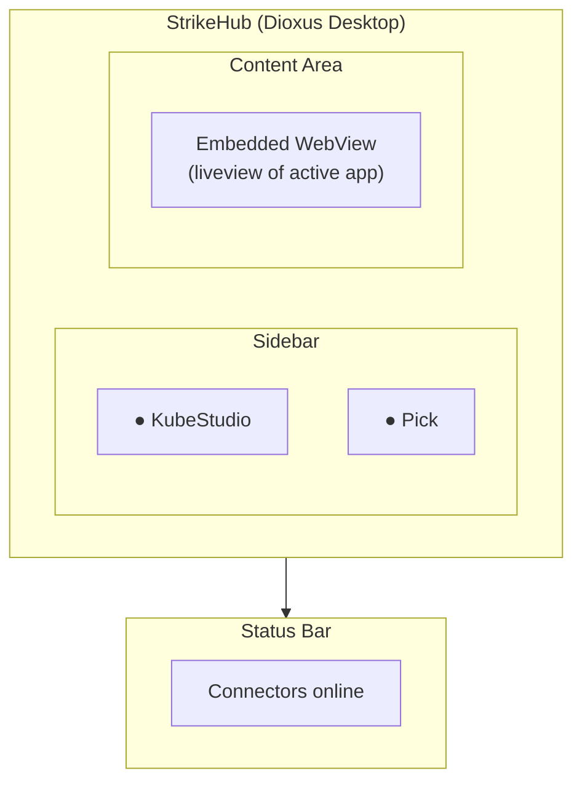

StrikeHub is a unified native desktop shell for Strike48 connector applications, built with Dioxus 0.6 and designed to host, manage, and render multiple connector apps within a single native window.

[**Install →**](/strikehub/guides/installation/)


## What is StrikeHub?

StrikeHub is a desktop application that acts as a host shell for Strike48 connector apps. It discovers running connector processes, communicates with them over IPC, and renders each as an embeddable panel inside a single native window. Connector apps are native desktop tools that integrate with the **Prospector Studio** agent platform. StrikeHub manages their lifecycle, authentication, and UI embedding so each connector can focus on its domain.

## Key Features

### Connector Sidebar
Browse and manage all registered connectors:
- Online/offline/checking status indicators
- One-click connector switching
- Visual connector health overview

### Embedded Content Area
Unified rendering of connector UIs:
- Renders the active connector's UI via an iframe backed by the `connector://` custom protocol
- Seamless switching between connector apps
- Native window integration

### Authentication
OIDC-based identity management:
- OIDC flow with Keycloak
- Automatic token injection into connector HTML
- Session management across connectors

### Health Monitoring
Continuous connector status tracking:
- Periodic health checks against each connector
- Automatic status updates in the sidebar
- Graceful handling of connector restarts

### Configuration
TOML-based connector management:
- Connector config at `~/.config/strikehub/connectors.toml`
- Environment variable overrides
- Per-connector settings

## Architecture



Each connector runs as a **separate process** with its own Axum HTTP server. StrikeHub embeds the connector's UI via an iframe pointed at a `connector://` custom protocol URL. Orchestration (health checks, lifecycle management) happens over the same Unix domain socket.

StrikeHub is built with a modular crate structure:

```
strikehub/
├── Cargo.toml          (workspace root)
├── crates/
│   ├── sh-core/        (config, IPC runner, auth, proxy, WS relay)
│   └── sh-ui/          (Dioxus desktop UI components)
```

## Technology Stack

- **Language**: Rust
- **UI Framework**: Dioxus 0.6 (desktop mode)
- **HTTP Server**: Axum
- **Integration**: Prospector Studio agent platform
- **Build Tool**: Just command runner

## Use Cases

StrikeHub is designed for:

- **Security Operations** - Host red team and security assessment connector apps in a unified workspace
- **DevOps Workflows** - Manage Kubernetes clusters and deployments via the KubeStudio connector
- **Team Collaboration** - Share a consistent desktop environment across teams
- **Connector Development** - Build and test new connectors with live-reload support

## License

StrikeHub is licensed under the Mozilla Public License 2.0 (MPL-2.0). You can use, modify, and distribute the software. Modifications to MPL-licensed files must be shared under the same license.

## Next Steps

Ready to get started? Check out the following guides:

- [Getting Started](/strikehub/getting-started/) — Install and run StrikeHub
- [Installation](/strikehub/guides/installation/) — Detailed build instructions
- [Configuration](/strikehub/guides/configuration/) — Environment variables and TOML config
- [Connectors](/strikehub/guides/connectors/) — How the connector system works
- [Debug Logging](/strikehub/help/debugging/) — Troubleshooting and debug logging
